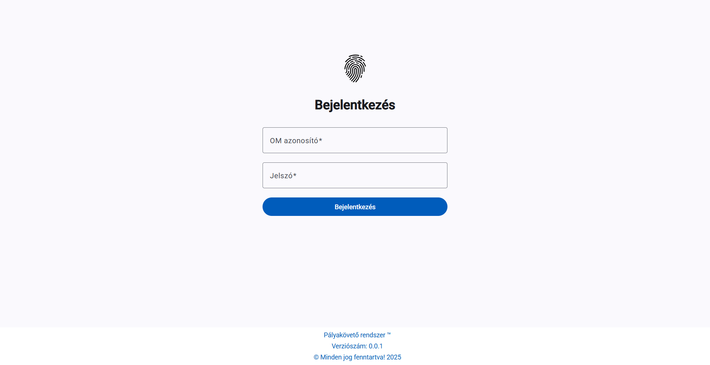
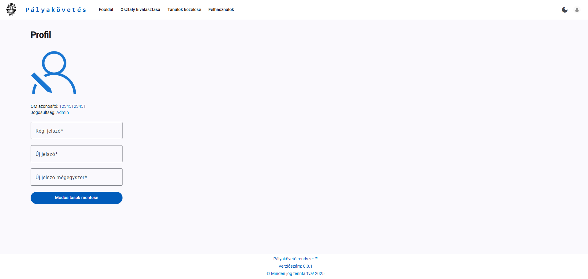

> [!WARNING]
> Ez a projekt **nem az eredeti pályamunka** ([palyakovetes](https://github.com/imbrainlezz/palyakovetes)), hanem annak egy teljesen átdolgozott és újraírt változata.</br>
> Az alapötlet és dizájn olykor hasonló, de a megvalósítás jelentősen eltérhet és el is tér az eredetitől.
# Pályakövető rendszer (career-frontend)
Ez a repo a pályakövető rendszer **frontend** része, mely a felhasználói felület, UI/UX megvalósításáért felel.
## Alapötlet
Minden felhasználó számára képes megjeleníteni, hogy ki, mikor és melyik középiskolát fejezte be és ezután hol állt munkába, vagy melyik egyetemen tanul tovább.
## Funkcionalitás
### Felhasználói jogosultságok és lehetőségek
- A felhasználók kizárólag **dolgozók** lehetnek; **regisztrációra nincs lehetőség**.  
- Új felhasználókat csak az **adminisztrátorok** hozhatnak létre.  
- A felhasználók a fiókjukkal:
  - **adatokat módosíthatnak**,  
  - **különböző szempontok szerint szűrhetnek**,  
  - az adatokat **.csv fájlba exportálhatják**.  
- A felhasználók **tanárok**, akiket **OM azonosítójuk** alapján azonosítunk.  
- Adminisztrátorok hozzák létre a tanárok fiókjait **előre megadott jelszavakkal**, amelyeket a tanárok **később bármikor megváltoztathatnak**.  
- Tanárok csak a **saját osztályaikat** láthatják, és ezekhez a fiókjukhoz tartozó **műveleteket végezhetik el**.
## Dokumentáció
[Angular](https://angular.dev/)</br>
[Angular CLI](https://github.com/angular/angular-cli) v20.2.0
### Fejlesztői szerver indítása (hot-reload)
```bash
ng serve
```
Cím: `http://localhost:4200/`
### Összeállítás
```bash
ng build
```
### Egységtesztek futtatása
```bash
ng test
```
### E2E tesztek futtatása
```bash
ng e2e
```
## Képernyőképek





